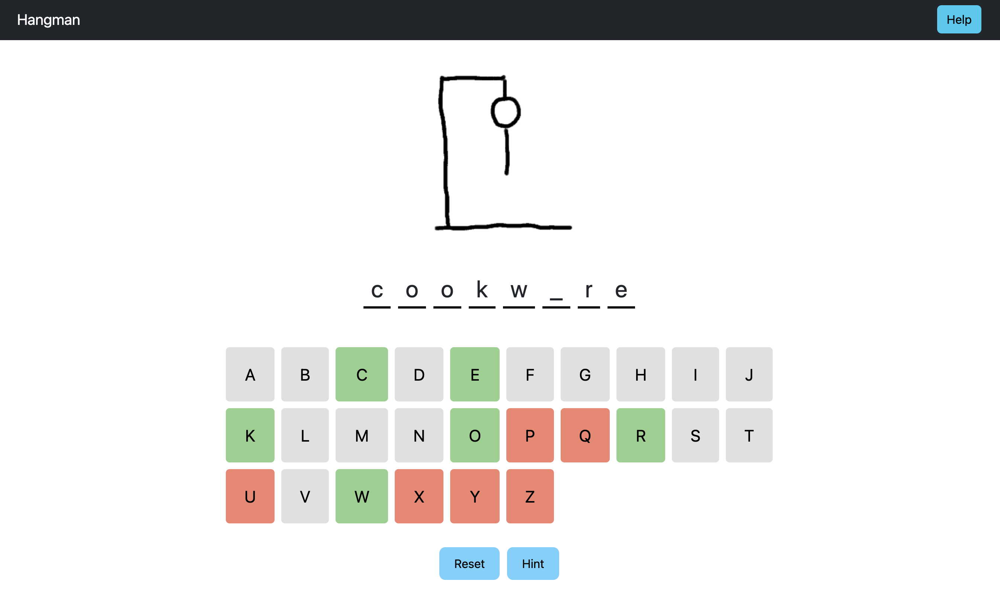

# Hangman Game

Check out the live demo [here](https://M311HAN.github.io/react-hangman/).

I have also deployed the app using Heroku. Check out the live demo [here](https://pure-eyrie-99914-9562340171be.herokuapp.com).




A classic Hangman game built using React.

## Table of Contents
- [Description](#description)
- [Features](#features)
- [Technologies Used](#technologies-used)
- [Installation](#installation)
- [Usage](#usage)
- [Components](#components)
- [Assets](#assets)
- [License](#license)
- [Create React App Info](#create-react-app-info)

## Description

This project is a simple implementation of the classic Hangman game. The user guesses the word letter by letter, with a limited number of incorrect guesses allowed before the game is lost. The game includes interactive and attractively styled components and is designed to be mobile-responsive.

## Features

- Random word selection from a dictionary file
- Interactive keyboard for guessing letters
- Displays the hangman figure progressively as incorrect guesses are made
- Informative messages for winning or losing the game
- Option to reset the game and get hints
- Help modal with game instructions
- Mobile-responsive design

## Technologies Used

- React
- React Bootstrap
- CSS
- Create React App

## Installation

1. Clone the repository:
    ```bash
    git clone https://github.com/yourusername/hangman-game.git
    cd hangman-game
    ```

2. Install the dependencies:
    ```bash
    npm install
    ```

3. Start the development server:
    ```bash
    npm start
    ```
Open your browser and navigate to `http://localhost:3000`.

## Usage

1. Start the game by guessing letters using the on-screen keyboard.
2. Correctly guessed letters will be revealed in the word and turn green on the keyboard.
3. Incorrectly guessed letters will be turned to the colour red on the keyboard, and the hangman figure will be drawn progressively.
4. The game ends when the word is fully guessed or the hangman figure is completely drawn.
5. Use the "Reset" button to start a new game.
6. Use the "Hint" button to reveal one letter in the word.
7. Click the "Help" button for game instructions.

## Components

- `Header`: Displays the game title and Help button.
- `Figure`: Displays the hangman figure.
- `Word`: Displays the current state of the word being guessed.
- `Popup`: Displays messages for winning or losing the game.
- `Keyboard`: Interactive on-screen keyboard for guessing letters.
- `Button`: Reusable button component for Reset and Hint actions.
- `Help`: Modal component displaying game instructions.

## Assets

- **Dictionary File:** The game reads words from a `dictionary.txt` file located in the `assets` folder.
- **Hangman Drawings:** The hangman figure is drawn using images stored in the `assets/hangmandrawings` folder.

## License

This project is licensed under the MIT License and created by Melihhan (https://github.com/M311HAN). [Visit the repository](https://github.com/M311HAN?tab=repositories) for more projects and further collaboration.

## Create React App Info

# Getting Started with Create React App

This project was bootstrapped with [Create React App](https://github.com/facebook/create-react-app).

## Available Scripts

In the project directory, you can run:

### `npm start`

Runs the app in the development mode.\
Open [http://localhost:3000](http://localhost:3000) to view it in your browser.

The page will reload when you make changes.\
You may also see any lint errors in the console.

### `npm test`

Launches the test runner in the interactive watch mode.\
See the section about [running tests](https://facebook.github.io/create-react-app/docs/running-tests) for more information.

### `npm run build`

Builds the app for production to the `build` folder.\
It correctly bundles React in production mode and optimizes the build for the best performance.

The build is minified and the filenames include the hashes.\
Your app is ready to be deployed!

See the section about [deployment](https://facebook.github.io/create-react-app/docs/deployment) for more information.

### `npm run eject`

**Note: this is a one-way operation. Once you `eject`, you can't go back!**

If you aren't satisfied with the build tool and configuration choices, you can `eject` at any time. This command will remove the single build dependency from your project.

Instead, it will copy all the configuration files and the transitive dependencies (webpack, Babel, ESLint, etc) right into your project so you have full control over them. All of the commands except `eject` will still work, but they will point to the copied scripts so you can tweak them. At this point you're on your own.

You don't have to ever use `eject`. The curated feature set is suitable for small and middle deployments, and you shouldn't feel obligated to use this feature. However we understand that this tool wouldn't be useful if you couldn't customize it when you are ready for it.

## Learn More

You can learn more in the [Create React App documentation](https://facebook.github.io/create-react-app/docs/getting-started).

To learn React, check out the [React documentation](https://reactjs.org/).

### Code Splitting

This section has moved here: [https://facebook.github.io/create-react-app/docs/code-splitting](https://facebook.github.io/create-react-app/docs/code-splitting)

### Analyzing the Bundle Size

This section has moved here: [https://facebook.github.io/create-react-app/docs/analyzing-the-bundle-size](https://facebook.github.io/create-react-app/docs/analyzing-the-bundle-size)

### Making a Progressive Web App

This section has moved here: [https://facebook.github.io/create-react-app/docs/making-a-progressive-web-app](https://facebook.github.io/create-react-app/docs/making-a-progressive-web-app)

### Advanced Configuration

This section has moved here: [https://facebook.github.io/create-react-app/docs/advanced-configuration](https://facebook.github.io/create-react-app/docs/advanced-configuration)

### Deployment

This section has moved here: [https://facebook.github.io/create-react-app/docs/deployment](https://facebook.github.io/create-react-app/docs/deployment)

### `npm run build` fails to minify

This section has moved here: [https://facebook.github.io/create-react-app/docs/troubleshooting#npm-run-build-fails-to-minify](https://facebook.github.io/create-react-app/docs/troubleshooting#npm-run-build-fails-to-minify)
